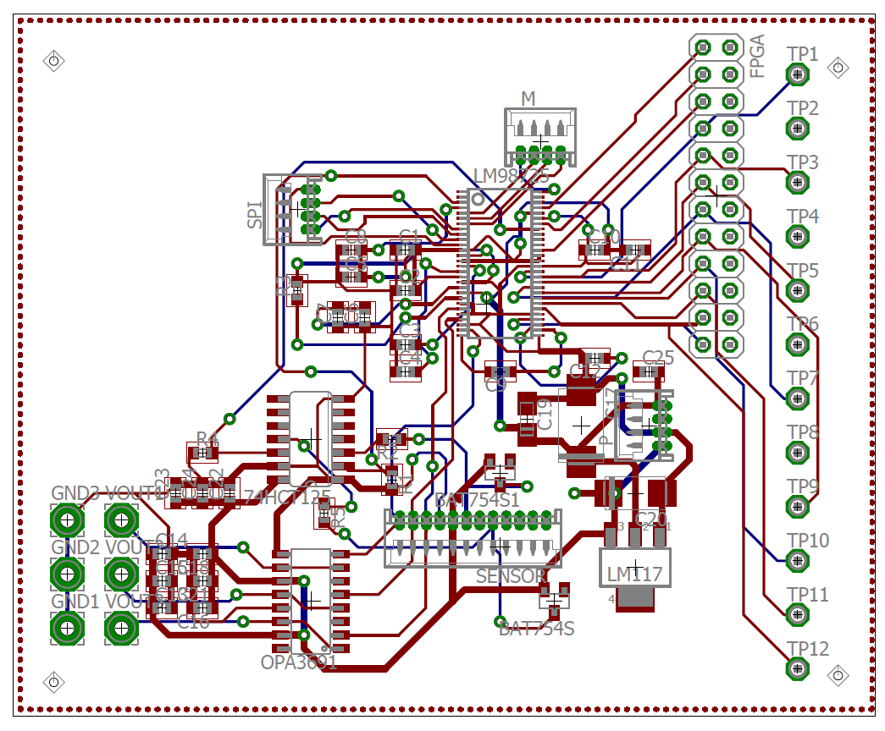

# Analog-Digital conversion circuit with an interface to a FPGA development board for an X-ray detector module of a 3D breast CT prototype

## Project Overview
This project focuses on the design and development of an ADC electronic circuit for a CMOS sensor coupled with CsI:Tl scintillating crystals to detects X-rays. The circuit samples analog pixels data from the sensor, crucial for analyzing beam geometry and sensor-scintillator response. An FPGA interfaces with the circuit to process the digital data from three sensor channels and store it on a host computer for image processing and analysis.

## Features
- 16-bits ADC circuit for 3 channel CMOS sensor.
- Serial Peripheral Interface (SPI)
- Designed voltage level shifter for interfacing +3.3V Analog front end LM98725 with a +5V CMOS sensor.
- Implemented voltage clamping circuit.
- Interfacing ADC with FPGA (NI sbRIO-9651) via LabVIEW.
- PCB layout and design using EAGLE

## Tools and Technologies

- **EAGLE** for schematic capture and PCB layout
- **LabVIEW** to acquires the digital data from the ADC in a sequence, converts this data into integer values and save the complete pixels data in a text file on the computer from each sensor channel.
- **Arduino** for SPI
- **Oscilloscope** for signal testing.
- **MATLAB** for anylyzing sesor data.

  
## Circuit Schematic
Here is the circuit schematic designed in EAGLE:

## PCB Layout
The PCB layout was created using EAGLE. Below is a preview of the PCB design:

## Designed PCB
Final designed PCB:

## Interfacing with FPGA

The 16 bits digital data from the ADC is arranged in a particular sequence such that it gives a single pixel value from each three channels of CMOS sensor. Two  LabVIEW programs (VI) source code are written and complied, one on the FPGA also called “target” to collects the sensor digital data and the other on the computer system referred as “host”. This data is received and saved to the host memory in the same order by implementing a FIFO method (First In First Out) that organize and prioritize the data with the time.

Communication and data flow between host computer and FPGA:

## Contact
For any questions, feel free to contact me at: [m.ahmerkhan@outlook.de](mailto:m.ahmerkhan@outlook.de).
